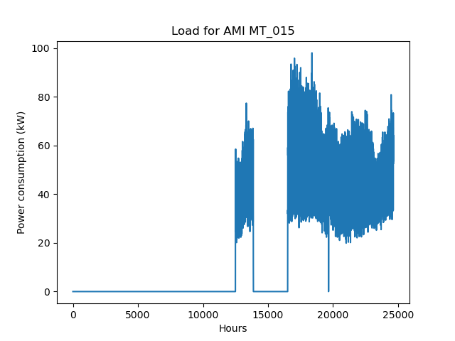
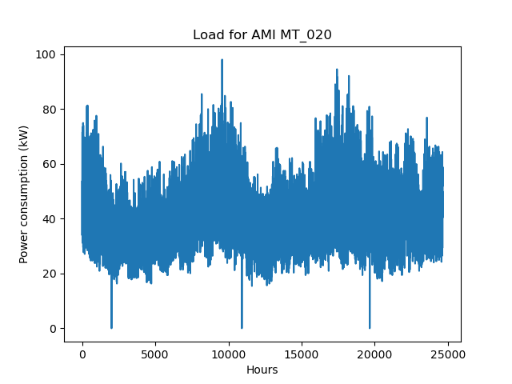
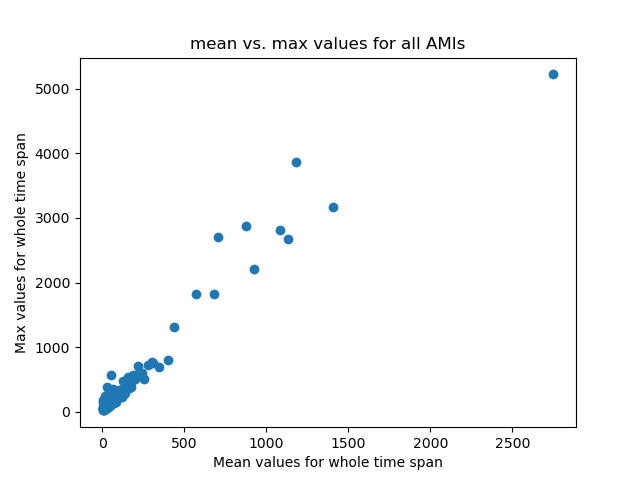
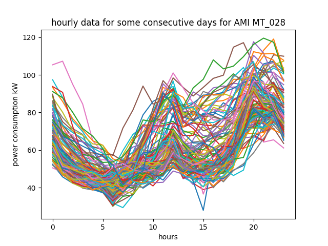
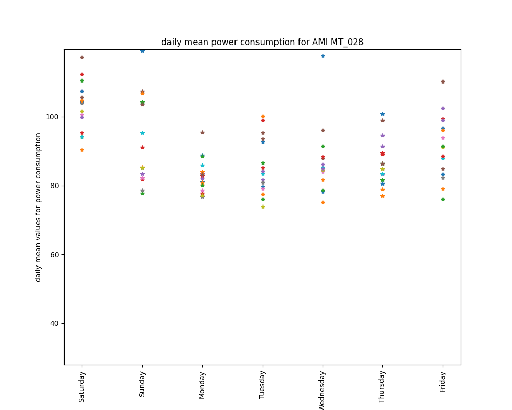
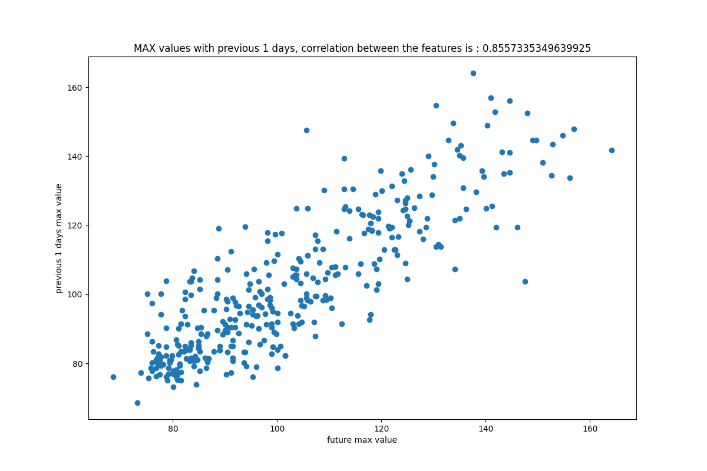
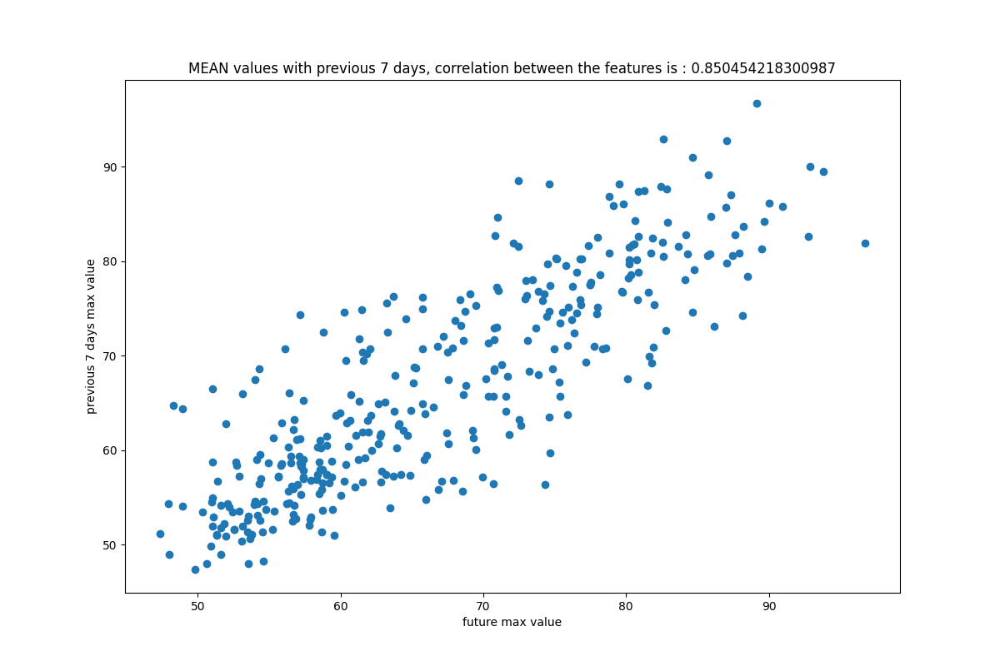
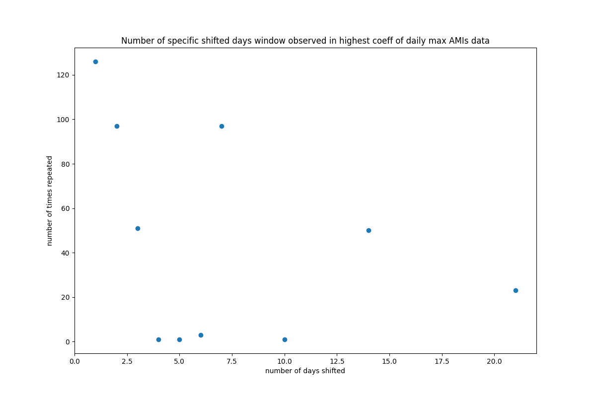
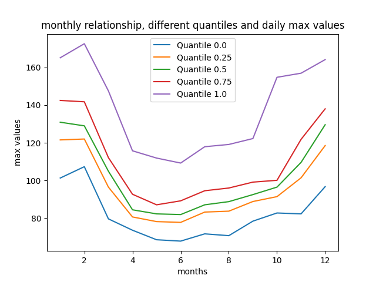
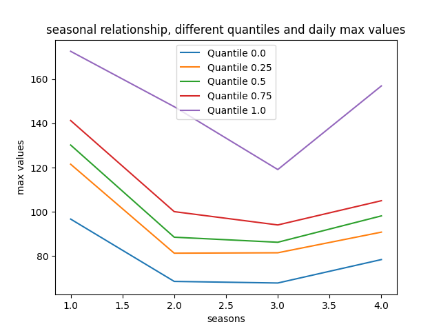

#Kevala Take Home interview (Data science)

## All candidates questions:
**Q1**. Load the data and do some exploration. Come up with a few (two or more) simple
questions about the data, write code to investigate and answer the questions, and briefly
discuss what you observe in the results. Please show that you have explored the dataset
but don’t spend too much time on this question!

* What is the type of data? how I can make it easier to work with as time series?
    > First of all, I printed the size and first five rows of the data to see the columns and type of the data. 
  > Moreover, as the given timestamps are string in the main provided data set, I change them to datetime format and 
  > set them as the Dataframe index. This will help us to use built-in functions of pandas for time series, such as 
  > easier query for extracting times, max, min functions and group by. For these reasons I used *Q1 block 1* in the code.
  > Also, I plotted all available data for some of AMIs just to see the signature and magnitude of the data. For instance:
  > 	
  > 
  > Which shows some anomaly data mainly due to data cleaning, or
  > 
  >    
  > 
> Which we can see some seasonality change in demand, which will be useful for our forecasting purpose.
  

* What is the relationship of mean value and max value for each AMI?
  > I wanted to see how different are the AMIs in terms of their size in load. Thus, I summarized them with their mean
  > and max value such that they can be easily clustered to residential (normal, or small)/business(large) loads. 
  > As we can see in the figure below there are few loads with higher max value above 1000 kW and mean value of 500 kW,
  > which shows they are different with other majority loads. Note that each dot represents a unique AMI.
  > For this purpose I used *Q1 block 2* in the code. 
  > 
  > 
  > 

* Do we have any anomaly in the AMI data?
  >Anomalies can be defined in many ways in time series data. One can consider those large loads mentioned above as anomaly,
  > however, in the context of this project, because of the data cleaning there are some days that probably we did not
  > have any captured data for some AMIs. Thus, these values forced to be zero. These can be considered as anomaly which
  > is better to removed from model training, or use other proxy data instead of them (such as another AMI data with a 
  > high correlation data with the current AMI with a multiplier). Such anomalies can be find by simple search for 
  > weeks with zero mean values. I used  *Q1 block 3* to find some simple anomalies which include 29 AMIs such as MT_015.
  > As we can see changing index to datetime format helped us to use resampling function.

**Q2**.Implement a function that calculates the daily maximum demand [kW] given a time
series of demand values. The input to the function should be an (hourly) time series
(timestamps and values) and the output should be another time series with the maximum
value of the input time series on each day in the original time series.

  >  *Q2 block* is used for this reason. The daily max function simply uses the resampling and returns the daily
  > maximum value within the hourly input data. It also can get all AMI hourly data and with a specific start and end time
  > it will return a dataframe that has all daily max values.
  > 

**Q3** Using the provided data, create a feature (model input) that could be useful in predicting
maximum daily load in the future. Without implementing a model, create a data
visualization that illustrates how your feature might be of use for the forecasting problem
described in the introduction. This is an intentionally open ended question - we would
like to see how you would begin to evaluate solutions to the forecasting problem. Your
visualization should show some relationship in the data that would be of interest when
developing a model. Include the visualization in your written report.

* *Q3 block 1* code 
  
  >To start obtaining proper feature for daily maximum power consumption forecasting, I plotted hourly demand for a random
  > AMI within a period of time (4 months) to see any common pattern in time of the day. As we can see in the figure below
  > there is a very similar pattern for everyday demand for this specific AMI. Normally, these types of hourly patterns 
  > can be used for hourly forecast, however, can be useful for the daily max forecast as well due to the fact that most 
  > of the max values for this AMI happens in last hours of the day (in case of missing data).
  > 
  > 
  > Also, I tried to see if there is any daily relationship between max daily values and day of the week, shown in figure 
  > below. This figure shows that there is a slight relationship between day if the week and max daily demand (such as 
  > higher value in Sundays). 
  > 

* *Q3 block 2* code 
  
  >In this block we have function (highest_coeffs) which gets a hourly time series for a AMI, number of most correlated
  > shifted days max/mean values, with different values of day shifts and returns the best shifts windows which have highest 
  > correlation coefficient with future max values. Then, for the same AMI mentioned above we get the previous max and
  > mean value window of the higher correlations. For this specific example, results show that for daily max values of previous
  >days, 1, 2 and 7 days of previous days has the highest correlation with their relative future values and 1, 6, 7 for
  > the daily mean values. Figures below show the corrcoeff of 1 previous days daily max () and 
  > corrcoeff of 7 previous days daily mean (), which were the highest among all shifted values.
  > These figure shows that previous max mean values can be very promising features for daily max forecasting.
  > 
  > 

* *Q3 block 3* code 
  
  >As we want to generalize our hypothesis for all dataset, in this code block I extracted which shifted days are 
  > the most common among all AMIs data. As both daily mean and max results shows, most common shifted days are
  > `[1, 2, 3, 7, 14, 21]`. This results, is totally in line with the logical concept mentioned in the Q1, which is 
  > load consumption has a weekly pattern and due to the daily pattern of using devices can be very dependent to the 
  > last three days electricity consumption.
  > 
  > 

* *Q3 block 4* code 
  
  >This block code shows the dependency of daily maximum values for all AMIs to season and month ot the year. Which means 
  > although we already know future daily max is related to previous days max/mean data, season and month could be a good 
  > indicator of what we should expect for the daily max value. In this figure I used different quantiles to show 
  > different levels of relationship between these features and daily max values.
  > 
  > 
  > 

**Q4** Describe (don’t implement!) a model to predict daily maximum demand values 7 days in
the future. The model does not need to be complicated or high performing, just a
possible solution to evaluate.

  ### Features extraction
  >As we mentioned above, in order to predict maximum daily demand, we better use, 1, 2, 3, 7, 14 and 21 days before 
  > daily max and mean values, as well as sme effective contextual features such as day of the week, week of the month,
  > month of the year and season. We can also consider some informative features such as holidays flag(0: non-holiday, 
  > 1: holiday) or if we have anomaly in the previous data or not (which can be interpreted as confidence of data accuracy).
  
   ### Model selection
  >Due to the results shown in the previous sections, simplest yet effective model can be linear regression. By considering
  >mentioned features, we do not have high dimensional feature space, moreover, we saw high correlation coefficient within
  > features and daily max values. Thus, linear regression would be great start. Also, a simple shallow neural network 
  > with relu activation function in the last layer can be would be the second option for evaluation.
  
- a.Are there any additional datasets you would want to acquire?
>Electricity consumption has a tight relation to weather data, as the HVAC system and other seasonal devices are used 
> frequently. Hence, having weather data, such as temperature, humidity, cloudiness index as well as location of the 
> installed AMI can help significantly. Other data such as type of building and used appliances can also help.
> 

- b.What features (model inputs) would you use?
>Please refer to ``Feature extraction`` section above.

- c.What is one prediction algorithm you would try?
>Please refer to ``Model selection`` section above.

- d. What sources of error do you anticipate in your model?

##### Feature based errors
>One source of error are the anomaly data mentioned in sections above, which can be due to AMI malfunction, outage, or
> possible event that cause missing data. On the other hand, if we do not consider holidays as feature, then an unexpected 
> daily high can be experienced. Adding new equipment or high demand appliances can be another error that can not be seen 
> in the historical feature data or any other contextual features. Some natural phenomena such as sudden change in weather
> can cause higher or lower demand which may result in lower accuracy. 
> 
 ##### Model based errors
>By choosing linear model, we may come across accuracy errors due to non-linearity in the feature space, however, 
> in this our case this can be very unlikely. Moreover, if we do not have access to enough sample data, without any data
> augmentation we may experience high variance  which we need to add more data to prevent over-fitting. Conversely, 
> we can have a very simple model that can cause high bias (under-fitting) so we need to make more complex models. Also,
> we may use cross validation and regularization as well for the mentioned possible issues.
